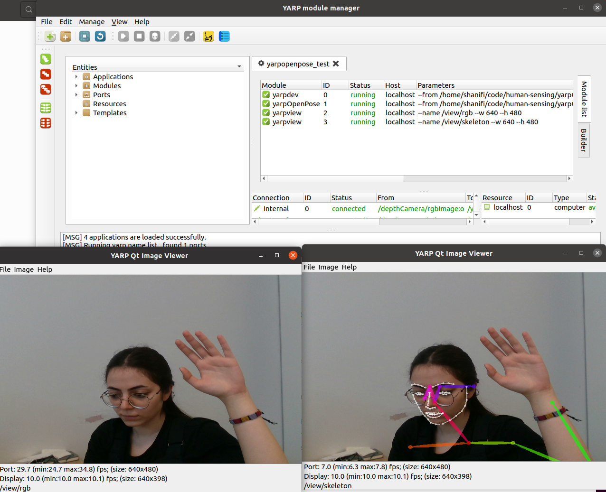

## Setting up yarpOpenPose with RealSense camera
In order to use yarpOpenPose with the intel realsense camera there are few steps to be taken:
  1. run ``yarpserver`` in the terminal.
  2. ``yarpmanager`` in the new terminal.
  3.  For a simple test, there should exist an application description XML file in the ``yarpOprnPose/app/scripts``. (Find a template to create it.)
  4. Also a ``yarpopenpose.ini`` and ``realsense.ini`` file in the ``yarpOprnPose/app/conf``. 
  5. In the ``yarpopenpose.ini`` we set the model path to be the path for your ``openpose/model `` . (In our case, we set the ``num_gpu=1``, ``num_gpu_start=0``. Also reduced the resolution because of the memory error.)
  6.  There was an error because the realsense device for YARP was not installed. To understand it type ``yarpdev --list`` and get the list of all the devices that are installed. To solve the problem installed the [yarp-device-realsense2](https://github.com/robotology/yarp-device-realsense2).
  7. Go to yarpmanager, run them all.
  8. connect them all

  

  If there is a problem with the skeleton view, there might be two sources:
1. `` yarpserver `` problem
     - Stop and disconnect everything.
     - close the yarpmanager.
     - stop the yarpserver.
     - rerun the yarpserver and repeat the test steps.
 2. eGPU problem:
     - When you connect an external GPU after you have already compiled the OpenPoseyou, you need to recompile it because the first compilation was with respect to the architecture of the internal GPU and not the eGPU. After that you can specify which GPU you want to use for your application. In the ``.ini `` file related to your application there are two variables related to the GPU. ``num_gpu``  and `` num_gpu_start ``. ``num_gpu`` identifies the number of GPUs used for that application and `` num_gpu_start `` is the variable that indicates from which GPU index it should start using the GPUs. To find out the index of the GPU use `` nvidia-smi`` command in the command line and check the numbers indicated in the GPU place for each GPU.