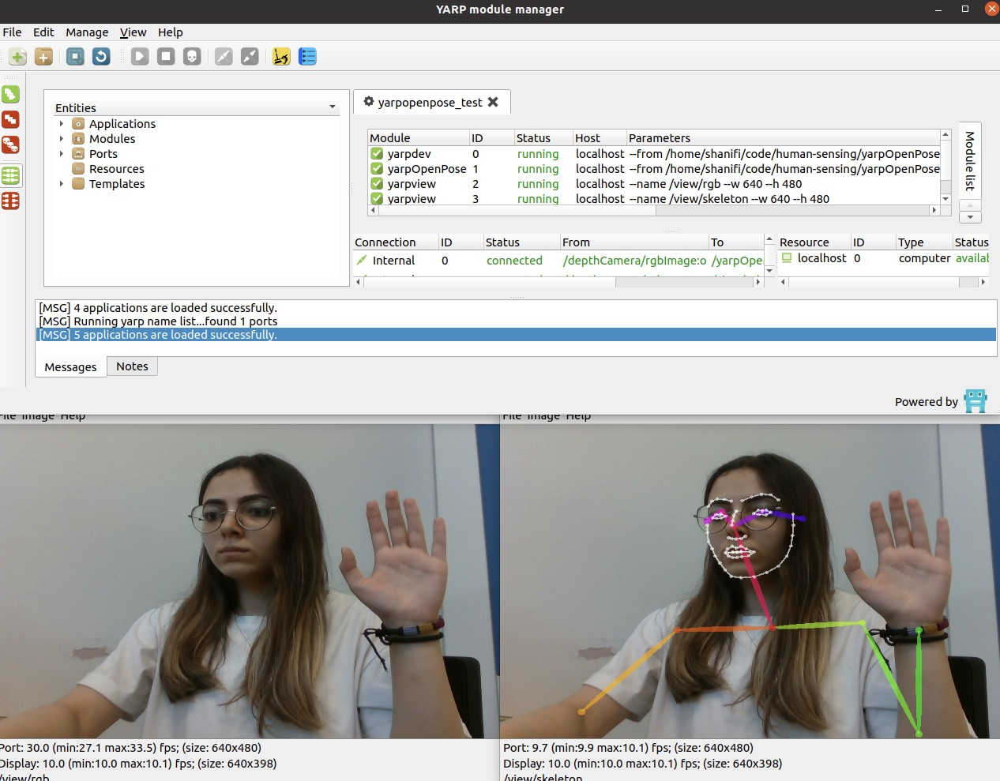
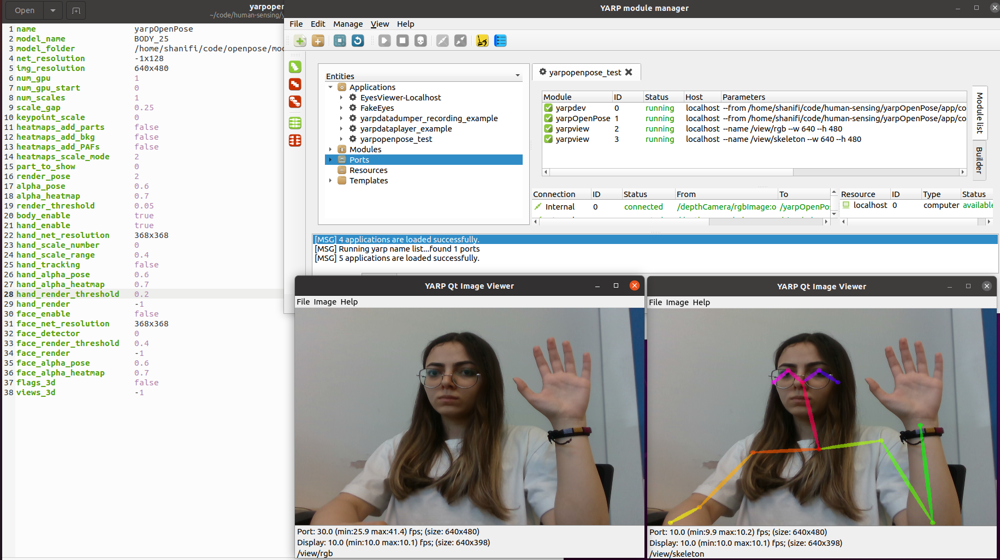
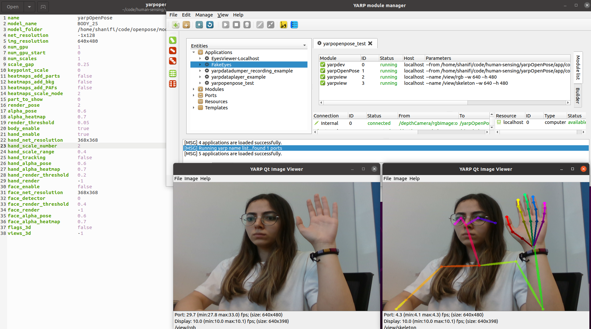

## RealSense Camera - Test 2

With this tutorial I will try to change different parts of the `yarpopenpose.ini` file. The goal is to dive deep and understand better :)

### First Error
As usual the skeleton view did not work at first :| 
No worries, I solved it. The reason was that last time, since we were using the eGPU we had set the `num_gpu` equal to 2 and also the `num_gpu_start` equal to 0 in the `yarpopenpose.ini` file. However this time I was not using the eGPU and it was causing the error. Therefore, I changed them back to 1 and 0 respectively. And it worked :))

## Applying Changes
- hand_enable
  
In the `yarpopenpose.ini` file, I changed the `hand_enable` to add the hands to the skeleton.

- num_scales

The initial value for `num_scales` is equal to 1. 

- hand_scale_number

I firste chnaged the `face_enable` to `false`, and then applied changes to `hand_scale_number` which was originally equal to 1. When I put it equal to 0, there was no hand points, and when I set to higher numbers the system slowed down! But I couldn't get what exactly it is doing :\

- part_to_show

This was interesting! The initial value for `part_to_show` is 0. I changed it to 1, 3 and 6. The result was interesting.

