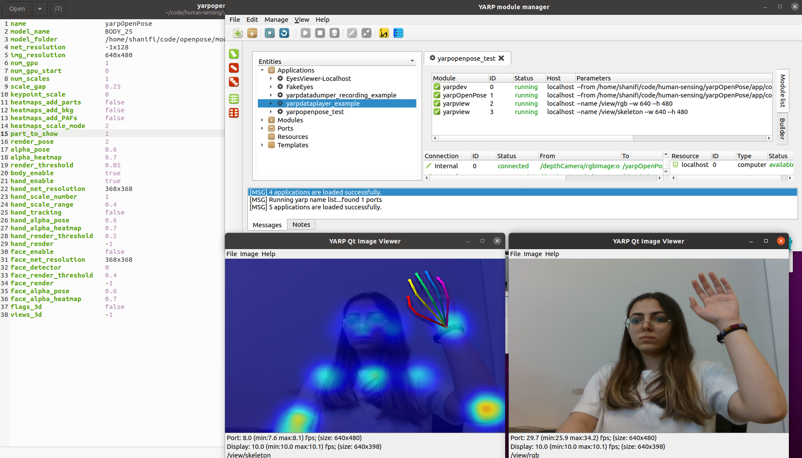
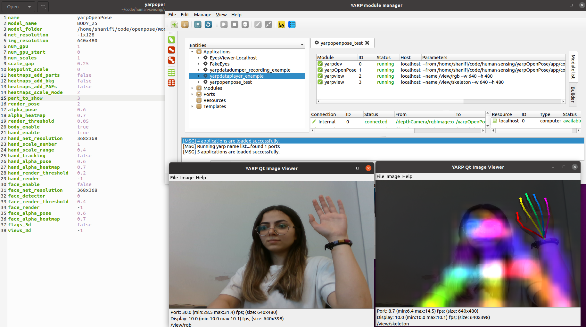
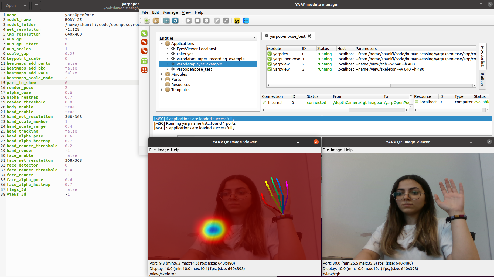
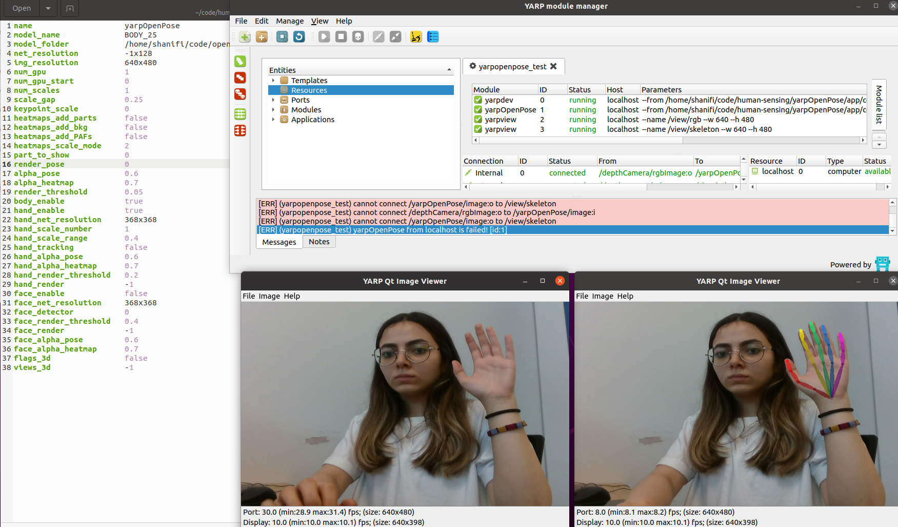
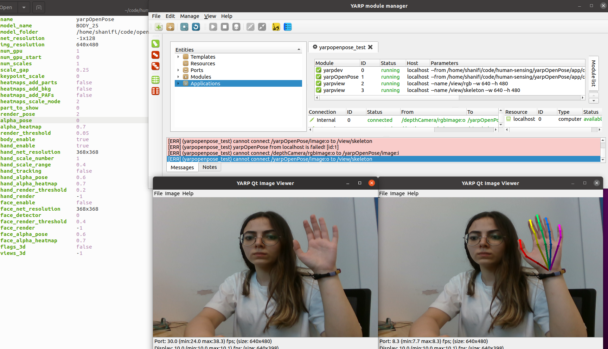
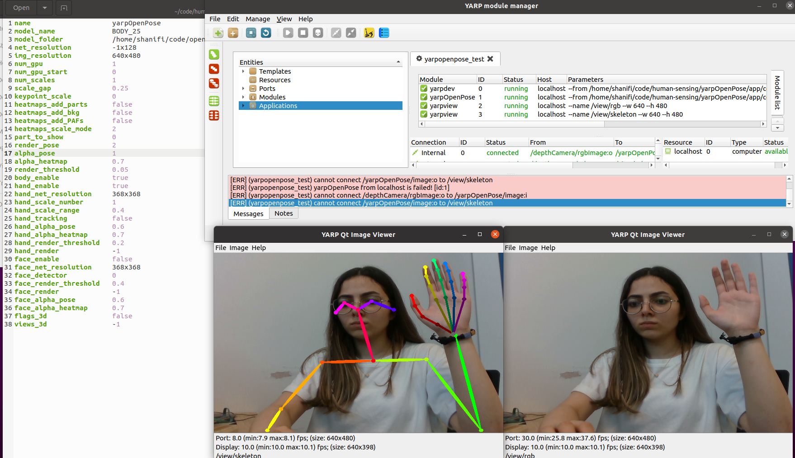
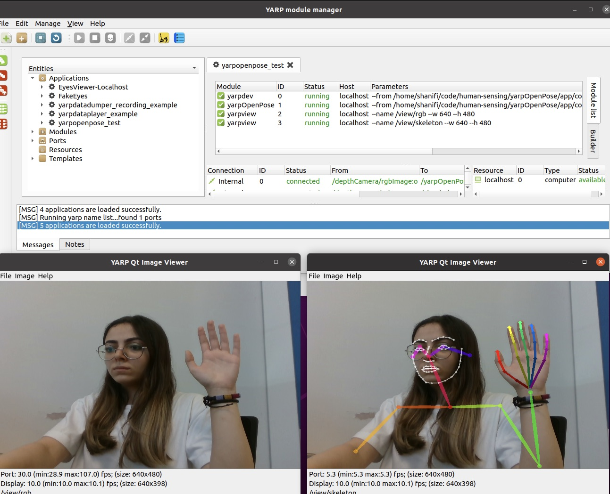

## RealSense Camera - Test 2

With this tutorial I will try to change different parts of the `yarpopenpose.ini` file. The goal is to dive deep and understand better :)

### First Error
As usual the skeleton view did not work at first :| 
No worries, I solved it. The reason was that last time, since we were using the eGPU we had set the `num_gpu` equal to 2 and also the `num_gpu_start` equal to 0 in the `yarpopenpose.ini` file. However this time I was not using the eGPU and it was causing the error. Therefore, I changed them back to 1 and 0 respectively. And it worked :))

## Applying Changes
Apply the changes to the `yarpopenpose.ini` file.

- num_scales

The initial value for `num_scales` is equal to 1. Changing it to any other number makes the skeleton view not work.
- scale_gap

The initial value for `scale_gap` is 0.25. I changed it to 1 and it still works. But I couldn't understand the difference!
- keypoint_scale

The initial value for `keypoint_scale` is 0. I changed it to 1 at first and it was still working (Couldn't tell the difference) but changing it to 10 made it not work.
- heatmaps_add_parts/bkg/PAFs

Initially they are all set to false. Setting them all to `true` made no difference!

- heatmap_scale_mode

It is initially set to 2. Making it 0 didn't change anything! And making it 10, stopped the skeleton view.

- part_to_show

This was interesting! The initial value for `part_to_show` is 0. I changed it to 1, 3 and 6. The result was interesting.

- render_pose

The initial value is 2. When set to 0 only hand keypoints were displaying. When set to 4, skeleton view did not display.

- alpha_pose

Initial value is 0.6. Setting it to 0 disabled the skeleton view and setting it to 1 enhanced the skeleton view.

- alpha_heatmap

The initial value os 0.7. Changed it to 0 and 1 but no difference :|

- render_threshold

Initially 0.05. Couldn't see the difference with 0, 0.5 and didn't work with 1.

- hand_enable
   
Changed the `hand_enable` to add the hands to the skeleton.

- hand_scale_number

I firste chnaged the `face_enable` to `false`, and then applied changes to `hand_scale_number` which was originally equal to 1. When I put it equal to 0, there was no hand points, and when I set to higher numbers the system slowed down! But I couldn't get what exactly it is doing :\

- hand_scale_range

Initially set to 0.4. Setting to 0 didn't work and with 1 worked the same way as 0.,4!

- hand_tracking

Setting it to true didn't change anything!

- face_detector

Initially set to 0. Changing it to 1 didn't work. with 0.5 there was no difference.

